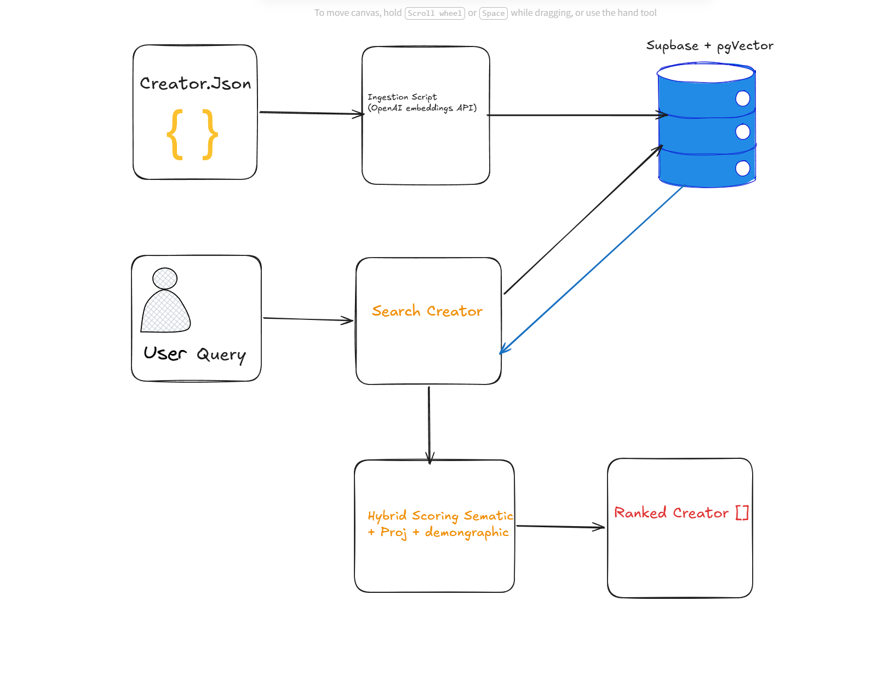

# RoCathon — Hybrid Creator Search Engine

A search engine that ranks TikTok Shop creators by combining **semantic similarity** with **commercial performance**. Built for the RoC Hackathon.

## Architecture



## How It Works

1. **Embed creators** — Each creator's bio, content tags, and audience demographics are embedded into a 1536-dim vector using OpenAI `text-embedding-3-small`
2. **Vector search** — When a brand searches, the query gets embedded the same way and pgvector finds the top 50 closest creators by cosine similarity
3. **Hybrid re-ranking** — Each candidate gets a final score using the formula below, then sorted

## Scoring Formula

I started with the recommended weights (0.45 / 0.55) and added a **demographic alignment bonus** as an extra 10% signal:

```
final_score = 0.40 * semantic_score + 0.50 * projected_score + 0.10 * demographic_bonus
```

| Signal | Weight | What it is |
|---|---|---|
| Semantic Score | 0.40 | Cosine similarity between query and creator embedding (0-1) |
| Projected Score | 0.50 | RoC's pre-computed commerce score, normalized from 60-100 to 0-1 |
| Demographic Bonus | 0.10 | 1.0 if creator audience matches brand's target gender + age, 0.5 for partial match, 0 otherwise |

**Why demographic bonus?** A beauty brand targeting women 25-34 should prefer creators whose audience IS women 25-34, even if the bio doesn't say so. This is a signal that semantic similarity alone can't capture.

**Why these weights?** Projected score gets the most weight (0.50) because the whole point is to avoid the AI search false positive problem — a creator with perfect vibes but $0 GMV should never beat one with good vibes and real sales. The 0.40 semantic weight still makes sure we're finding relevant creators, not just top sellers.

## Setup

### 1. Clone and install

```bash
git clone <repo-url>
cd RoCathon-main
npm install
```

### 2. Environment variables

```bash
cp .env.example .env
```

Fill in your `.env`:
- `OPENAI_API_KEY` — from [platform.openai.com/api-keys](https://platform.openai.com/api-keys)
- `SUPABASE_URL` — your Supabase project URL
- `SUPABASE_SERVICE_ROLE_KEY` — from Supabase Dashboard > Settings > API

### 3. Supabase setup

1. Create a free project at [supabase.com](https://supabase.com)
2. Go to **SQL Editor** and run everything in `sql/setup.sql` — this creates the tables and the vector search function

### 4. Ingest creators

```bash
npm run ingest
```

Embeds all 200 creators and inserts them into Supabase. Uses OpenAI `text-embedding-3-small`. Safe to re-run (upserts).

### 5. Run demo

```bash
npm run demo
```

Runs 3 search queries and saves results to `output/results.json`. Also generates `output/submission.json` with the brand_smart_home top 10.

### 6. Run any custom query

```bash
npm run search -- "your query here" brand_smart_home
```

Available brands: `brand_smart_home` (default), `brand_fitness`, `brand_beauty`

Examples:

```bash
npm run search -- "Affordable home decor for small apartments"
npm run search -- "High-energy fitness content" brand_fitness
npm run search -- "Gentle skincare routines" brand_beauty
npm run search -- "Tech gadgets for college students" brand_smart_home
```

## Extra Features

- **Query cache** — Repeated queries skip the OpenAI API entirely. Embeddings are cached in a `query_cache` table so the same search is instant and free the second time.
- **Enriched embeddings** — Creator embeddings include audience demographics in the text (e.g. "Audience: primarily female, ages 25-34"), so demographic-related queries get better semantic matches.
- **HTTPS connection** — Uses the Supabase JS client instead of direct Postgres, so it works on any network regardless of IPv4/IPv6 support.

## Project Structure

```
RoCathon-main/
├── creators.json              # 200 mock creators
├── sql/
│   └── setup.sql              # DB schema + vector search function
├── src/
│   ├── types.ts               # TypeScript interfaces (given)
│   ├── db.ts                  # Supabase client
│   ├── embed.ts               # OpenAI embedding + query cache
│   └── searchCreators.ts      # Hybrid search (semantic + projected + demographic)
├── scripts/
│   ├── setupDb.ts             # Prints setup SQL
│   ├── ingest.ts              # Embeds + inserts creators
│   ├── demo.ts                # Runs demo queries, outputs JSON
│   └── search.ts              # CLI — run any custom query
└── output/
    ├── results.json           # All demo results
    └── submission.json        # brand_smart_home top 10 (submission file)
```

## Tech Stack

- TypeScript + Node.js
- OpenAI `text-embedding-3-small`
- Supabase (Postgres + pgvector)
- `@supabase/supabase-js`
